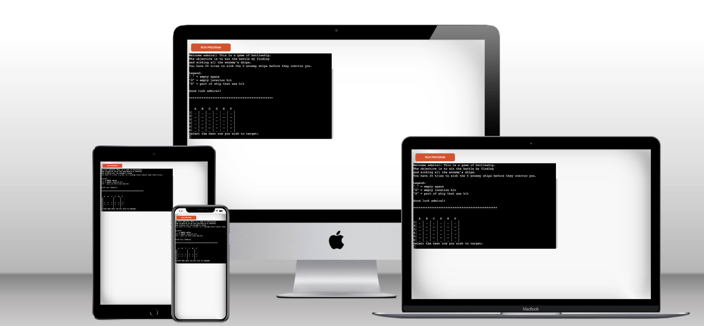
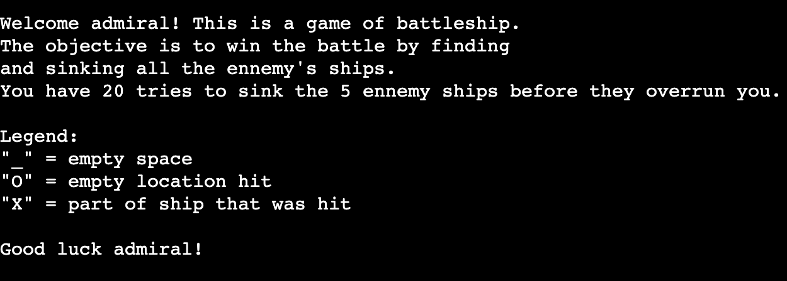
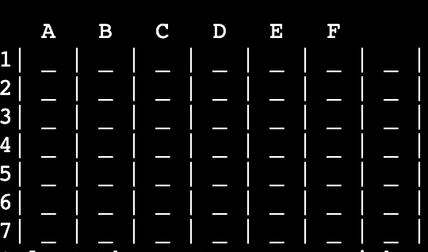
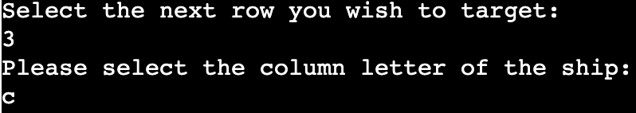
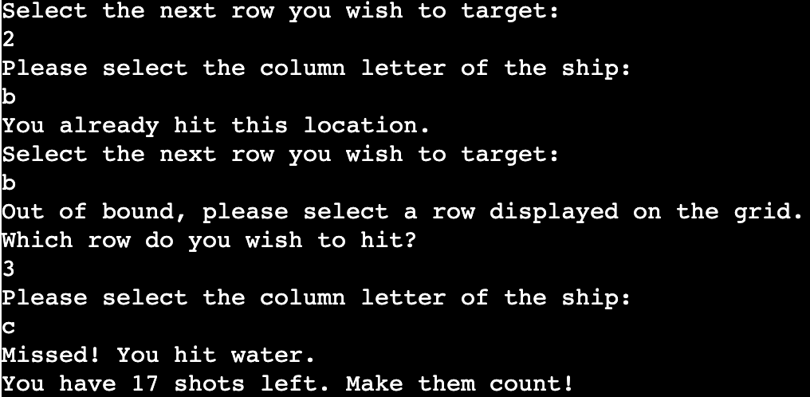
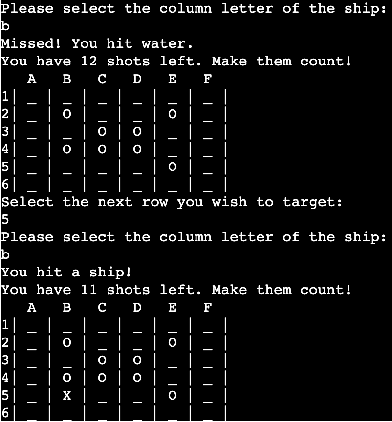

# Object Oriented Python: A Battleship Game

Welcome,

Everyone knows the game of **Battleship** and is familiar with the rules. You will find here a representation of the Battleship game run through a Python terminal. This terminal is running on Heroku.

The purpose of the game is for the users to find all the computer ships (5 ships) before the player runs out of tries/bullets/guesses. Each ship occupies one square on the grid.

[View the live version of the programme running on Heroku](https://project3-battleship-project.herokuapp.com/)

## How to play
Battleship is a turn-based naval strategy game. Originally known as a pencil and paper game, the game has evolved in its format and has its own variations. You can find out more about this game and its history on its [Wikipedia page](https://en.wikipedia.org/wiki/Battleship_(game)#:~:text=Battleship%20(also%20known%20as%20Battleships,concealed%20from%20the%20other%20player.).

In this version of the game, the player sees the guess board. This is a one player game where the player has to try and sink all the ennemy ships before he is running out of tries. 

Each turn, the user will be select to select a row and a column that will work as coordinates to target a location on the grid. The outcome of this selection will display a "O" for a missed shot, or water, or a "X" for a hit. Locations that have not been hit yet are marked on the grid by a "_".

## Features

### Implemented features

- Introduction message explaining the programme, the game, and the winning conditions:

- The grid with the numbers for the rows and the letters for the columns to guide the player in how to select locations. The printing will iterate for the number of columns. The 5 ennemy ships are randomly generated on the grid (but of course not displayed):

- Input message to invite the player to select the next coordinates for the next try:

- Logic to verify the input for rows and columns.
    - Verifies if the row input is an integer.
    - Converts the row input in coordinates (substracts 1)
    - Verifies if the column is a letter.
    - Converts the letter in a number.

- Outcome logic after input has been validated
    - Verifies if the selected coordinates have not been previously hit.
    - Checks on the grid if an ennemy ship is located there.
    - Checks on the grid if it is an empty location. 
    - Reduces the count of tries left by one.

### Future Features

Imagination can go a long way. Battleship, through its variations, is a good display of that. Due to time constraints, I could not implement all the features I wanted to make available for the players. These features may be released in future updates:

- Restart new game at the end of the current game,
- Add a player grid to display the ships,
- Have a computer trying to hit the players' ships,
- Add several lengths and allow different directions for ship placement,
- Ask for difficulty input to define size of the grids (initially implemented and then removed),
- Add color based on the outcome.

## Data Model

For this project, there are 2 classes that define the model:
- Grid
- Ship

The choice of using two classes was done for scalability of future features. In this version of the game, the `Grid` and the `Ship` classes store the `grid` argument. The function `print_game_board_grid()` is taking the size parameters and defines which letters to print based on the grid size and how many numbers to print for each row.

The second class, `Ships`, contains more functions. `generate_ships()` is going to generate 2 random numbers that will act as coordinates (row, column). This will iterate 5 times for the 5 ennemy ships to be generated and positioned. These coordinates will be used to position the ennemy ships on the grid by marking (but not printing) the location with `X`.

Within this same class, `get_coordinates_input()` will ask for the player to select first a row number, validate this first input and then a letter for the column, which will also be validated as well. 

The final method for this object, `counter_numbers_of_ships_hit()` will keep track of the number of ships and increase the count for each ship being hit. 

## Testing

### User goals

| **Goal**                                                                                               | **Outcome**                                                                             |
| -------------------------------------------------------------------------------------------------- | ----------------------------------------------------------------------------------- |
| As a user, I want to understand the main purpose of the site.                                      | Intro message explains the goal of this programme.                                       |
| As a user, I want to easily understand the rules.                                                  | Win conditions are described in the intro message. |
| As a user, I want to know exactly what coordinates I can choose                                      | The grid prints numbers for rows and letters for columns. Each input is asked for separately.                             |
| As a user, I want to know input only correct coordinates.                                      | Data validations rules are there to make sure the player only rows and columns displayed on the grid.                             |
| As a user, I want to know how many tries I have left before losing.                                  | Counter for tries is printed after each shot.         |
| As a user, I want to read the outcome of each round.                                               | Outcome message displayed after each round.                                         |
| As a user, I want to be able to start a new game when the current game has come to an end.         | Not implemented yet.                                  |
| As a user, I want to be able to run the game from GitHub and from Heroku         | Programme is running on both terminals.                                  |

### Technology

The code is passing the PEP8 linter validation. No errors were identified. 

## Bugs

### Fixed Bugs

* Creating a grid in Python 
Numbers for the grid did not print and only `1` was added on the first row. StackOverflow was a good place to start. Several questions and outcomes were proposed to solve this:
- [How to make a board in python?](https://stackoverflow.com/questions/40566675/how-to-make-a-board-in-python)
- [Creating a row of numbers/ letters in my Python Battleship game](https://stackoverflow.com/questions/53446425/creating-a-row-of-numbers-letters-in-my-python-battleship-game).

* Pylance kept identifying an error in regards to a try/except statement. Disabled pylance in the except statement thanks to a solved question on [Stackexchange](https://stackoverflow.com/questions/53408630/catching-all-exceptions-without-pylint-error).

* `generate_ships()` was creating ships out of bound when trying to pass the grid argument from the object. The hard value 6 is now used to generate the ship on the 6x6 grid.

### Validator testing

- PEP8
    - No problems were identified from [PEP8 Online Check](http://pep8online.com/checkresult)

## Deployment

This project was deployed using Code Institute's mock terminal for Heroku.

  - Steps for deployment:
    - Create a copy of the [Python Essentials Template](https://github.com/Code-Institute-Org/python-essentials-template) repository
    - Freeze the requirements.txt
    - Create a new [Heroku](https://dashboard.heroku.com/apps) app.
    - Set the buildbacks to `Python` and `NodeJS` in that order.
    - Link the Heroku app to the repository (in the read.me)
    - Click on __Deploy__.

## Credits

- Several ressources were identified in helping creating the Battleship game. [DioCar84's Battleship project](https://github.com/DioCar84/battleships/blob/2f5cca939e4f50f6064233ef7733f7a1f99a64b8/run.py) of the CodeInstitue was a good source of inspiration for the data model. 
- Austin Montgomery's [Python for Beginners: Battleship](https://bigmonty12.github.io/battleship) was a step by step guide that helped me throughout fixing some of the bugs I encountered.
- [CaringTiger's Battleship repo](https://github.com/caringtiger/battleships/blob/master/main.py#L7).
- [StackOverflow](https://stackoverflow.com/) was a great source for identifiying technical challenges I was facing and for helping to move forward.
- Quinto's question on [StackOverflow](https://stackoverflow.com/questions/36609140/how-to-make-this-battleship-game-more-user-friendly-in-terms-of-values)
- My mentor, Ronan. A great help in moving forward and identfying the appropriate resources.
- My friends Greg and Colm for their support on the final steps of the projet and helping bring some perspective on some of the functions (looking at you `print_game_board_grid()` and `generate_ships()`).
- [Wikipedia](https://en.wikipedia.org/wiki/Battleship_(game)) for the rules and history of the Battleships game